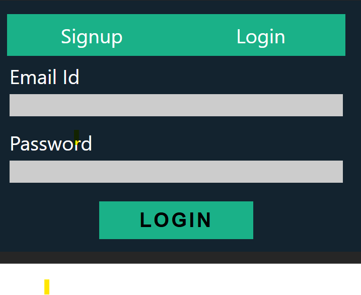

# hcl-hackathon

# Hackathon Project: Full Stack Authentication System

A full-stack application featuring JWT authentication, built with React, Node.js, and MongoDB for a secure user management system.

## Overview

This project implements a complete authentication system with:
- User registration and login functionality
- JWT-based security
- Protected routes

## Technologies Used

- Frontend: React.js
- Backend: Node.js with Express
- Database: MongoDB
- Testing: Jest
- Authentication: JSON Web Tokens (JWT)
- Styling: CSS Modules
- Package Manager: pnpm with vite
- Security: Helmet, dotenv, secure HTTP headers
- DevOps: Docker, .env for secrets management

## Features

1. **Authentication**
- Secure JWT-based login system
- Password hashing with bcrypt
- Token refresh mechanism(if time permits)
- Protected routes

2. **User Management**
- Registration
- Login/logout functionality
- Patient dashboard
- Session persistence

3. **Security**
- helmet used for security purposes tohandle CSRF, XSS attacks
- using .env files and docker to store the sensitive information.

### Approach

Core Components

- Frontend: 

    Built using React.js with Vite for fast development and optimized builds.
    State management handled via Redux.
    React Router is used for navigation and implementing protected routes.
    JWT tokens are securely stored in localStorage and used for authentication and authorization across the app.
    Implements lazy loading for route-based code splitting, significantly improving load performance on large-scale applications.
    Styled using CSS Modules for scoped and maintainable styles.
    Managed with pnpm, a faster and more efficient package manager than npm/yarn.    
    
- Backend: 

    Developed using Node.js and Express.js, with clearly structured API routes for user actions like signup, login, and logout.
    Password hashing implemented using bcrypt to securely store user credentials.
    JWT tokens are issued upon login and can optionally be stored in the database for refresh token functionality.
    Middleware ensures that protected routes are accessible only to authenticated users.
    Uses Helmet to enhance security by setting HTTP headers, protecting against common vulnerabilities like XSS, CSRF, and clickjacking.
    Designed for scalability and modularity with separate route, controller, and service layers.

    

    

Data Model: Used below one because of time constraint. Can be improved with more details

    {
     name: { type: String, required: true },
    username: { type: String, required: true, unique: true },
    email: { type: String, required: true, unique: true },
    password: { type: String, required: true },
    role: { type: String, required: true }
    }

- Thing that can be implemented but not implemented due to time constraint
 1. We can scale front end using micro frontend architecture and use pnpm workspaces or Nx for monorepo support
 2. We can use css libraries to utilize well built css components
 3. Refresh Token Rotation, Multi-Factor Authentication (MFA), OAuth Integration
 4. Rate Limiting & Throttling, Audit Logging, Security Headers, CORS
 5. Testing: Unit testing using jest, End-to-End Testing
 6. Quality: Code Coverage Tools, sonarqube
 7. DevOps & Deployment: Docker Compose, Environment-Specific Configs
